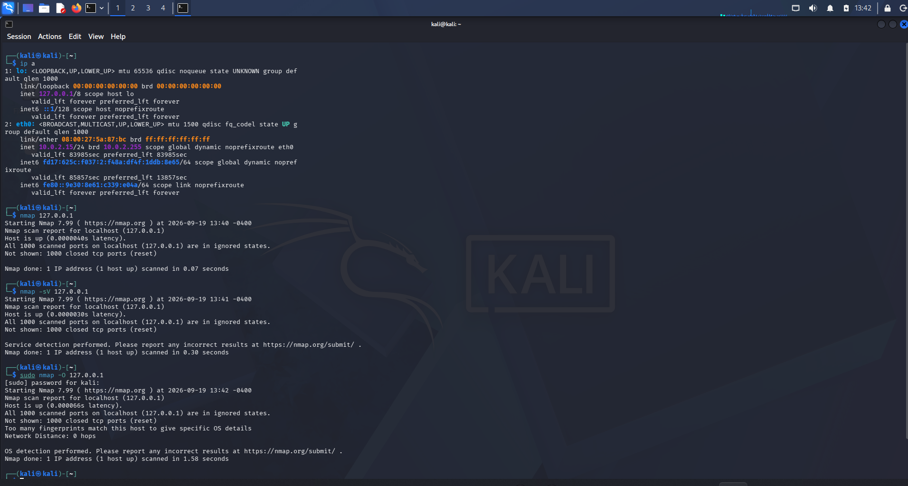

# Task 1 – Basic Network Scanning with Nmap

**Internship:** Oasis Infobyte (OIBSIP) – Security Analyst  
**Date:** September 2026  
**Student:** Prince Quarcoo

---

## What is Nmap?

Nmap (Network Mapper) is an open-source tool used for network discovery and security auditing. Security professionals use it to find live hosts, open ports, running services, and operating systems on a network.

---

## Why Network Scanning Matters

Network scanning is important because it helps us:

- Find what devices and services are running on a network
- Identify possible security weaknesses
- Understand how exposed a system is
- Make sure only necessary services are left open

It is usually one of the first steps in both defensive security and ethical hacking.

---

## Ethical Guidelines

- Only scan systems you own or have clear permission to scan
- Never scan public IPs or systems without authorization
- Unauthorized scanning is illegal and unethical
- For this task, I only scanned my own local Kali Linux virtual machine in VirtualBox

---

## Tools Used

- Nmap 7.99 (already installed on Kali)
- Kali Linux 2026.2 running on VirtualBox
- Target IP: 127.0.0.1 (localhost)

---

## Installation

Nmap is pre-installed on Kali Linux, so no extra installation was needed.

---

## Scans Performed

I performed three different scans:

1. Basic scan  
   Command: `nmap 127.0.0.1`

2. Service version detection  
   Command: `nmap -sV 127.0.0.1`

3. OS detection  
   Command: `sudo nmap -O 127.0.0.1`

---

## Results

All three scans showed that all 1000 scanned ports on 127.0.0.1 were closed.  
No open ports or services were found.

OS detection also could not give a clear result because too many ports were closed. This is normal when scanning localhost on a clean Kali VM.

**Conclusion:**  
Having no open ports on localhost is actually a good thing from a security point of view because it means there is a very small attack surface.

---

## Screenshot

---

## References

- Nmap official documentation: https://nmap.org/docs.html
- Kali Linux: https://www.kali.org
